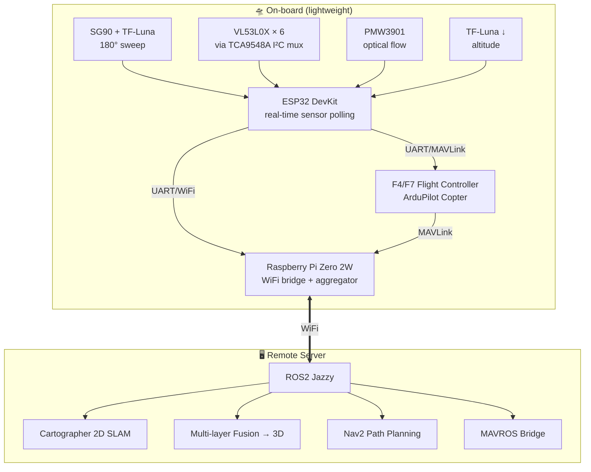

# claudedrone 🚁

> Autonomous indoor mapping drone for GPS-denied environments. Distributed compute architecture: lightweight onboard, heavy SLAM offloaded to a remote server.

[](https://github.com/paskoaleks1986-prog/claudedrone)
[](https://docs.ros.org/en/jazzy/)
[](https://ardupilot.org/)
[](https://gazebosim.org/)
[](LICENSE)

---

## What

A research drone that builds 3D maps of indoor spaces (warehouses, tunnels, industrial facilities) where GPS does not work and visual cameras struggle (poor lighting, repetitive textures, dust, smoke).

**Key idea:** instead of expensive 3D LiDAR or vision-based SLAM, use a *stop-scan multi-layer* approach with cheap ToF sensors (TF-Luna + VL53L0X array). The drone hovers at multiple altitudes, sweeps a 2D scan at each level, and fuses the layers into a 3D occupancy map.

**Why distributed compute:** the drone itself only handles real-time control and sensor reading (Pi Zero 2W + ESP32 — under 100 g of compute). All heavy processing (SLAM, path planning, fusion) runs on a remote workstation over WiFi. This keeps the drone small, cheap, and energy-efficient.

## Status

Active development since late March 2026. Currently:

- ✅ Full Gazebo Harmonic + ArduPilot SITL + MAVROS + ROS2 Jazzy pipeline
- ✅ Custom `iris_claudedrone` model with full sensor mounts
- ✅ Indoor environment with 5×4 m room, central column, lighting
- ✅ Basic autonomous takeoff in GUIDED mode
- ✅ Indoor parameter set for GPS-denied flight (optical flow + rangefinder)
- ✅ ROS2 sensor monitoring node with priority alerts
- 🟡 Stop-scan methodology (in progress)
- 🟡 Multi-layer fusion (in progress)
- ⏳ Cartographer SLAM integration
- ⏳ Hardware assembly
- ⏳ First real-world flight

See [docs/planning/roadmap.md](docs/planning/roadmap.md) for the public roadmap and [docs/planning/current-status.md](docs/planning/current-status.md) for live status.

## Demo

*Video coming end of May 2026 — full simulation cycle with multi-layer mapping in `indoor_room.sdf`.*

<!-- Once recorded:
[](https://www.youtube.com/watch?v=VIDEO_ID)
-->

## Architecture



For detailed architecture see [docs/architecture.md](docs/architecture.md).

## Hardware

| Component | Part | Notes |
|---|---|---|
| Frame | Source Two 6" | Lightweight indoor frame |
| Motors | MT2204 2300KV | Quad config |
| ESC | 4-in-1 (model TBC) | See [docs/components/esc-4in1/](docs/components/esc-4in1/) |
| Flight Controller | F4/F7 | ArduPilot Copter |
| Companion Computer | Raspberry Pi Zero 2W | WiFi bridge + sensor aggregation |
| Real-time MCU | ESP32 DevKit | Sensor polling, servo control |
| 2D Scan | TF-Luna on SG90 | 180° sweep, ~10 cm – 8 m range |
| Altitude | TF-Luna ↓ | Downward-facing |
| 360° Obstacle | VL53L0X × 6 | Via TCA9548A multiplexer |
| Optical Flow | PMW3901 | Indoor X/Y velocity |
| PWM Driver | PCA9685 | Servo control |
| I²C Multiplexer | TCA9548A | 8-channel for ToF array |
| Power Distribution | PDB with Dual BEC | 5 V / 12 V outputs |

Component-specific docs and specs in [docs/components/](docs/components/).

## Software Stack

- **OS:** Ubuntu 24.04 LTS
- **ROS2:** Jazzy
- **Simulation:** Gazebo Harmonic + ArduPilot SITL
- **SLAM:** Cartographer (2D, planned), RTAB-Map (3D, future)
- **Navigation:** Nav2 (planned)
- **MAVLink Bridge:** MAVROS
- **Firmware:** ArduPilot Copter, custom ESP32 firmware (PlatformIO, planned)

## Quick Start

For complete setup instructions see [docs/SETUP.md](docs/SETUP.md).

The short version (assuming ROS2 Jazzy + Gazebo + ArduPilot SITL already installed):

```bash
# Clone
git clone https://github.com/paskoaleks1986-prog/claudedrone.git
cd claudedrone/simulation

# Build
source /opt/ros/jazzy/setup.bash
colcon build --symlink-install
source install/setup.bash

# Set Gazebo resource path
export GZ_SIM_RESOURCE_PATH=$PWD/src/drone_sim/models:~/ardupilot_gazebo/models

# Terminal 1 — Gazebo
gz sim src/drone_sim/worlds/indoor_room.sdf -r

# Terminal 2 — ArduPilot SITL
cd ~/ardupilot/ArduCopter
sim_vehicle.py -v ArduCopter -f gazebo-iris --model JSON --console \
  --add-param-file=$HOME/claudedrone/simulation/config/ardupilot/indoor.parm

# Terminal 3 — ROS2 launch
ros2 launch drone_sim drone.launch.py
```

In the SITL console:
```
mode GUIDED
arm throttle
takeoff 2
```

## Repository Structure

```
claudedrone/
├── README.md                    ← you are here
├── docs/
│   ├── SETUP.md                 ← complete setup guide
│   ├── architecture.md          ← system design
│   ├── components/              ← hardware datasheets and notes
│   ├── dev-log/                 ← raw engineering journey notes
│   ├── planning/
│   │   ├── current-status.md    ← what's working now (updated weekly)
│   │   ├── current-sprint.md    ← this week's tasks
│   │   └── roadmap.md           ← public development phases
│   ├── roadmap.md               ← high-level phases (deprecated, see planning/)
│   └── sensors.md               ← sensor overview
├── firmware/                    ← ESP32 + FC firmware (Phase 2)
├── hardware/
│   └── schematics/              ← wiring diagrams
├── media/
│   └── photos/                  ← component photos, schemas
├── simulation/                  ← ROS2 workspace
│   ├── config/ardupilot/
│   │   └── indoor.parm
│   └── src/drone_sim/
│       ├── drone_sim/           ← Python ROS2 nodes
│       ├── launch/
│       ├── models/
│       │   ├── claudedrone/     ← static reference model
│       │   └── iris_claudedrone/ ← Iris-based ArduPilot model
│       └── worlds/
└── software/                    ← future onboard + LLM layers
```

## Why this exists

Indoor autonomous navigation is dominated by two approaches today:

1. **Expensive 3D LiDAR systems** (Hovermap, Exyn) — €30k–€100k+ per unit
2. **Vision-based SLAM** (Skydio, Voxl) — fails in low-light, dusty, or visually repetitive environments

This project explores a third path: **cheap ToF sensors + smart scanning patterns + offboard compute**. The hypothesis is that for many industrial use cases (warehouse inventory, tunnel inspection, post-disaster mapping), a sub-€2,000 drone with ~€500 of sensors and a remote workstation can deliver 80% of the capability at a fraction of the cost.

The architecture also has interesting space applications: techniques for navigation in GPS-denied and visually-degraded environments — originally developed for orbital and lunar exploration — can be adapted to terrestrial industrial use cases, and vice versa.

## Roadmap

See [docs/planning/roadmap.md](docs/planning/roadmap.md) for the development phases.

## Contributing

This is an active research project run by a single developer. Issues and discussions welcome.

If you're working on similar problems (GPS-denied navigation, ToF sensor fusion, distributed robotics compute, indoor SLAM), I'd love to hear from you. Open an issue or reach out via [LinkedIn](https://www.linkedin.com/in/aleks-pasko-9aa56b372/).

## License

MIT — see [LICENSE](LICENSE).

## Author

**Aleksandr Pasko** — robotics engineer based in Portugal. Building claudedrone as an exploration of low-cost autonomous navigation for industrial use cases.

- GitHub: [@paskoaleks1986-prog](https://github.com/paskoaleks1986-prog)
- GitLab: [@alekspasko](https://gitlab.com/alekspasko)
- LinkedIn: [aleks-pasko](https://www.linkedin.com/in/aleks-pasko-9aa56b372/)
- YouTube: [@ClaudeDrone](https://www.youtube.com/@ClaudeDrone-f5b6q)


[del]test-mirror-hithab
